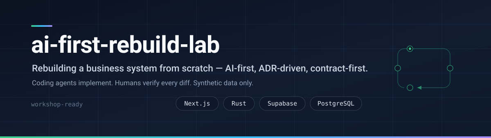
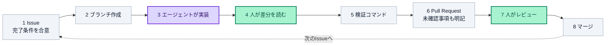

  

  
  
  
  
  
   
  
  
  
  

  <a href="docs/project-overview.md">プロジェクト概要</a> ·
  <a href="docs/architecture.md">アーキテクチャ</a> ·
  <a href="docs/development-approach.md">開発の進め方</a> ·
  <a href="docs/adr/">設計判断（ADR）</a> ·
  <a href="docs/how-to-join.md">参加方法</a> ·
  <a href="docs/workshop/README.md">ワークショップ</a>

---

## なぜこのプロジェクトが始まったか

社内で続いてきた技術ワークショップの、**新しい題材**として発足しました。

そのワークショップが教えてきたのは、コーディングそのものではありません。**設計を先に固め、レビューを通してから実装する** — その順序を身につけることでした。そして題材だったのは、**まさにこのプロジェクトが作り直そうとしている旧システム**です。

新しい題材でも、その核は変わりません。変わるのは道具立てです。

| これまで | このプロジェクト |
| --- | --- |
| 設計書を書く | **Issueの完了条件を合意する** |
| レビューを受ける | レビューを受け、判断を **ADR** に記録する |
| 自分で実装する | **AIエージェントが実装し、人が差分を検証する** |
| 動作確認する | 検証コマンドを通し、**確認できなかったことも書く** |

**人の役割が「書くこと」から「検証すること」へ移ります。** これまで教えてきたことの上に、AI-first という新しい軸が乗る構造です。

「設計を先に固める」規律を持たないままAIエージェントに実装させると、生成された差分を評価する基準がありません。**この順序を先に持っていることが、AI-first開発の前提になります。**

---

## 何を作っているか

その旧システムを、**Next.js / Rust / Supabase** を中心とした構成へゼロから作り直しています。対象領域はメンバー管理を中心に、経歴・スキル、現場・案件、面談、人事考課、権限管理まで広がる業務システムです。詳しくは [project-overview.md](docs/project-overview.md) を参照してください。

> [!IMPORTANT]
> **このリポジトリにコードはありません。** 開発は別のprivateリポジトリで行っています。ここは、参加を検討している方とワークショップ参加者のための入口です。

> [!NOTE]
> **開発で扱うのは合成データだけです。** 実在する人物の情報や、実際に運用されていたデータは使いません。機密情報の取り扱いを心配する必要はありません。

## 開発サイクル

このプロジェクトの中心にあるのは、次のループです。**AIエージェントが実装し、人が必ず差分を検証します。**

紫 = エージェントが担う工程　／　緑 = 人が必ず担う工程

「コードが生成されただけでは、タスクは完了していない」— この原則を運用に落とし込んでいます。実際のIssue1件を着手からマージまで追った記録は [issue-walkthrough.md](docs/workshop/issue-walkthrough.md) にあります。

## このリポジトリで読めるもの

- [x] **設計判断の実物**（ADR） — 元に戻しにくい判断をすべて記録したもの
- [x] **AIエージェントへの共通指示の実物**（`AGENTS.md`）
- [x] **再利用可能な作業手順の実物**（skills）
- [x] **Issue着手からマージまでの実例** — 実際にクローズされたIssue1件を再現
- [x] **アーキテクチャとサービス境界の設計思想**
- [x] **ロードマップと現在地**
- [ ] アプリケーションコード — 公開しません

## はじめに読む

<table>
<tr>
<td width="50%" valign="top">

### 参加を検討している方へ

まず [プロジェクト概要](docs/project-overview.md) と [開発の進め方](docs/development-approach.md) を読んでください。

参加の手順は [参加方法](docs/how-to-join.md) にあります。社内メンバー、有志、自己学習目的の方、いずれも歓迎します。

</td>
<td width="50%" valign="top">

### ワークショップ参加者の方へ

[ワークショップ資料](docs/workshop/README.md) を参照してください。

当日は実際のIssueに着手し、Pull Requestを1本提出するところまでを体験します。事前準備は [prerequisites.md](docs/workshop/prerequisites.md) にあります。

</td>
</tr>
</table>

## 技術スタック

| 層 | 技術 | 役割 |
| --- | --- | --- |
| Web | **Next.js**（Vercel） | 画面、SSR/BFF、認証セッション連携 |
| API | **Rust**（Render） | 業務ルール、認可、トランザクション |
| データ | **Supabase** | PostgreSQL / Auth / Storage |

ブラウザから業務データテーブルへの直接書き込みは行わず、更新経路をRust APIに集約しています。境界の設計思想は [architecture.md](docs/architecture.md) を参照してください。

現在は Phase 5「業務機能移行」が進行中です。詳しくは [roadmap.md](docs/roadmap.md) を参照してください。

## 文書一覧

<b>すべての文書を表示</b>

 

| 文書 | 内容 |
| --- | --- |
| [project-overview.md](docs/project-overview.md) | 何を作っているか、なぜ作り直すか、扱うデータ |
| [architecture.md](docs/architecture.md) | 技術構成とサービス境界 |
| [development-approach.md](docs/development-approach.md) | AI-first開発・ADR駆動・契約優先・検証文化 |
| [roadmap.md](docs/roadmap.md) | フェーズと現在地 |
| [how-to-join.md](docs/how-to-join.md) | 参加方法 |
| [faq.md](docs/faq.md) | よくある質問 |
| [adr/](docs/adr/) | 設計判断の記録 |
| [reference/agents-md.md](docs/reference/agents-md.md) | AIエージェント向け共通指示の実物 |
| [reference/skills.md](docs/reference/skills.md) | 再利用可能な作業手順の紹介 |
| [workshop/README.md](docs/workshop/README.md) | ワークショップ開催概要 |
| [workshop/prerequisites.md](docs/workshop/prerequisites.md) | 事前準備 |
| [workshop/agenda.md](docs/workshop/agenda.md) | 当日の流れ |
| [workshop/issue-walkthrough.md](docs/workshop/issue-walkthrough.md) | Issue着手からマージまでの実例 |

## 質問・参加申込

このリポジトリの **Discussions** をご利用ください。

| カテゴリ | 用途 |
| --- | --- |
| 参加申込 | 開発参加の希望 |
| 質問 | プロジェクトや技術構成についての質問 |
| ワークショップ | 開催告知、事前質問、当日Q&A |
| アナウンス | フェーズの進捗報告 |

> [!TIP]
> **Pull Requestは受け付けていません。** 開発はprivateリポジトリで行っているためです。誤字脱字などの指摘はDiscussionsの「質問」カテゴリでお知らせください。

## ライセンス

このリポジトリの文書は [CC BY 4.0](https://creativecommons.org/licenses/by/4.0/) の下で提供されます。帰属表示があれば、コピー、共有、改変が可能です。

参加にあたっては [行動規範](CODE_OF_CONDUCT.md) をお読みください。
