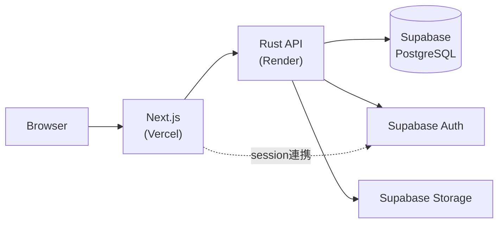

# アーキテクチャ

対象領域そのものはコードを見なければ深く語れませんが、**サービス境界の設計思想**は公開できます。ここでは、何がどこにあり、なぜその境界を引いているかを説明します。

## 全体構成



- **Next.js（Vercel）**: 画面、SSR/BFFに必要な薄い処理、Supabase Authのセッション連携を担当します。
- **Rust API（Render）**: 業務ルール、認可、トランザクション、帳票、移行CLIを担当します。
- **Supabase**: PostgreSQL、Auth、Storageを提供します。Row Level Securityは、公開対象を最小化する防御層として使います。

## 境界の原則

**ブラウザから業務データテーブルへの直接書き込みは行いません。** 更新経路はすべてRust APIに集約します。これは次の理由によります。

- 業務ルールと認可判定を1か所に集約し、クライアントごとの実装差異による認可漏れを防ぐため
- トランザクション境界をアプリケーション層で明示的に制御するため
- 監査・ログの取得点を単純化するため

Supabaseの認可（Row Level Security）は、この境界が破られた場合の**防御層**として位置づけており、唯一の認可機構としては設計していません。認可はデータベースの制約とクエリレベルの絞り込みを組み合わせ、アプリケーション層の判定だけに頼らない設計を重視しています。

## 契約優先の設計

Rust APIとNext.jsの境界を人手で重複定義すると、path・request・response・error shapeの差異をレビューだけでは検出しにくくなります。このプロジェクトではOpenAPI 3.1ドキュメントをHTTP API契約の正とし、次の経路で運用しています。

1. OpenAPIドキュメントをlintで検証する
2. そこからTypeScriptクライアントを自動生成する
3. 生成型に薄いruntimeクライアントを結びつける
4. CIでdrift（契約とコードの乖離）を検査する

契約と実装が乖離すればCIで検出される、という状態を維持することが目的です。

## リポジトリ構成（開発側）

開発は別のprivateリポジトリで行っています。構成の概要（コードそのものは含みません）です。

```text
apps/
  web/                 # Next.js
  api/                 # Rust API
crates/
  domain/              # 再利用可能な業務ドメインロジック
  migration-cli/        # データ移行・検証
supabase/
  migrations/
  seed.sql             # 匿名化した最小開発データのみ
docs/
  adr/                 # 設計判断の記録
  runbooks/
.github/workflows/
```

これらのパスは目標レイアウトであり、対応するスライスの着手時に追加します。空のプレースホルダーは作りません。

## 設計判断の記録

元に戻しにくい判断は、すべてADR（Architecture Decision Record）として記録しています。実際の判断内容は [adr/](adr/) を参照してください。

---

本文書は [CC BY 4.0](https://creativecommons.org/licenses/by/4.0/) の下で提供されます。
